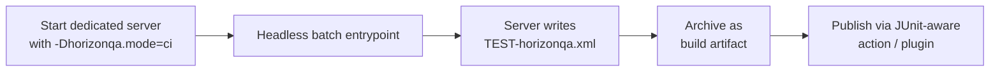

# CI & JUnit reports

Batch execution writes **`TEST-horizonqa.xml`** in the server working directory when `/horizonqa runall` (or a headless batch entrypoint) completes. The format is the standard JUnit XML schema, so any JUnit-aware result publisher will pick it up unchanged.

## Report contents

```xml
<testsuite name="horizonqa" tests="…" failures="…" errors="…" skipped="…" …>
  <testcase name="methodName" classname="namespace:ClassName" time="…">
    <!-- failure / error / system-out elements as appropriate -->
  </testcase>
</testsuite>
```

| Field        | Meaning                                                    |
|--------------|------------------------------------------------------------|
| `classname`  | Test id prefix (`namespace:ClassName`)                     |
| `name`       | Method name                                                |
| `time`       | Duration in seconds (`testTicks / 20`)                     |

Failed tests include stack traces. Passing tests with warnings or recorded events also emit `<system-out>` blocks.

## Event log in CI

When event recording is enabled (default), each `<testcase>` can include the ordered `[t=NNN] [category] summary` log. The same log is mirrored to the server console (last 20 lines on failure) so a Jenkins console snippet is enough to triage most recipe, EU, and maintenance failures without a local rerun.

Disable for perf-sensitive jobs only — you lose the main failure diagnostic:

```text
-Dhorizonqa.events=off
```

Full catalog: [Test event log](../reference/events.md).

## CI pipeline shape



In words:

1. Start a dedicated server with `-Dhorizonqa.mode=ci`.
2. Horizon-QA discovers tests and starts the batch once the world is ready.
3. Archive `TEST-horizonqa.xml` as a build artifact.
4. Point Jenkins / GitHub Actions `publish-unit-test-result` (or your equivalent) at the XML.

To run only part of the suite, pass `-Dhorizonqa.tests=<selector>`. A token without `:` selects a namespace, while a token with `:` must be an exact test id. For example, `-Dhorizonqa.tests=horizonqaexamples` runs that namespace and `-Dhorizonqa.tests=horizonqaexamples:BasicTests.simplePass` runs one test.

Invalid selector syntax, including empty tokens and `*`, aborts before execution. Valid selectors that match no valid tests are reported as infrastructure issues; any other matched tests still run.

If no valid tests are selected, CI still writes `TEST-horizonqa.xml`. By default this is a diagnostic error and exit code `2`; set `-Dhorizonqa.allowNoTests=true` only for jobs where an empty selection is expected.

CI exit codes are deterministic:

| Code | Meaning                                                                                                     |
|------|-------------------------------------------------------------------------------------------------------------|
| `0`  | The run passed. Optional test failures do not fail the process.                                             |
| `1`  | At least one required test failed or timed out.                                                             |
| `2`  | Infrastructure, configuration, discovery, selection, template, cleanup, reporting, or incomplete-run error. |

This repository's docs site build ([`.github/workflows/publish.yml`](https://github.com/GTNewHorizons/Horizon-QA/blob/master/.github/workflows/publish.yml)) runs `mkdocs build` and `./gradlew :javadoc` on push to `master`. Consumer mods wire their own game-test CI on top of the same shape.

## `required = false` and skipped semantics

Optional tests that fail may be reported without failing the suite aggregate. Reserve this for genuinely quarantined cases — required tests should gate merges, and a permanent failing-optional test is a maintenance leak.

## Local iteration loop

```text
edit test → runServer → /horizonqa run <id>   → inspect overlay + XML
         → /horizonqa runfailed              → re-run only the failures
```

## Publishing these docs

Documentation is published to GitHub Pages from `master`. To preview locally:

```bash
pip install -r requirements.txt
mkdocs serve
```

Open `http://127.0.0.1:8000` for live-reload preview.
