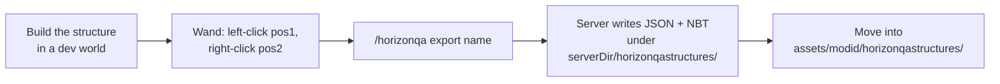

# Structure templates

Structures are compact JSON layouts plus optional NBT for tile entities. They are versioned alongside your mod jar and referenced by name from `@GameTest`.

## On-disk layout

After export or hand-authoring:

```text
src/main/resources/assets/<namespace>/horizonqastructures/
  my_cell.json
  my_cell_tiles.nbt    (optional; tile entity data)
```

Runtime resolution is by classpath:

```text
/assets/<namespace>/horizonqastructures/<path>.json
```

Reference from tests:

```java
@GameTestHolder("mymod")
public class MyTests {
    @GameTest(template = "multiblock/ebf") // resolves to mymod:multiblock/ebf
}
```

## Export workflow



1. Build the structure in a dev world with Horizon-QA enabled.
2. Select bounds with the **Horizon Wand**: ++left-button++ for pos1, ++right-button++ for pos2.
3. Run `/horizonqa export <name>`. Allowed characters: letters, digits, `_`, `-`.
4. The server writes to `<serverDir>/horizonqastructures/`:
   - `<name>.json` with the block palette and layers.
   - `<name>_tiles.nbt` with tile entity data, if any.
5. Move both files into your mod's `assets/<modid>/horizonqastructures/`.

!!! tip "Use `/horizonqa pos` while authoring"

    Stand inside the structure and run `/horizonqa pos`. The output gives you click-to-copy `helper.absolute(x, y, z)` snippets for controllers and hatch roles, much faster than translating world coordinates by hand.

## Format

Templates use `format_version: 1`, a palette keyed by single-character symbols, and a `layers` array in Y-major order. The loader throws `IOException` with explicit messages for missing layers and unknown palette keys; on a load failure the server log identifies the file and the offending key. Tile entity data is stored separately in `_tiles.nbt` and merged at placement time.

## Placement in the grid

The batch runner places each test's template into a dedicated cell on the void world grid with margin for clearance. Structure placement emits `StructurePlaced` in the [event log](../reference/events.md), so a missing structure surfaces in CI without a manual rerun.

## Rotation

Set `rotation` on `@GameTest` (values `0-3`) to validate that role indices and `Multiblock` wiring still match after 90° steps. If a test only passes at `rotation = 0`, document why in a short comment; that asymmetry almost always points at a coordinate that should have been a role lookup.

## Empty templates

Omit `template` (or use `template = ""`) for tests that only need void space: block-placement smoke tests, helper API checks, and the like.

## Choosing between `setBlock` and an exported template

Every test falls into one of two categories, and the right template strategy follows from which one you are writing.

### Logic tests: empty template + `setBlock`

A **logic test** verifies behaviour that does not depend on a specific world layout. The test builds exactly the state it needs via `setBlock`, runs the logic under test, and asserts the outcome. No template file exists on disk.

```java
@GameTest(timeoutTicks = 20)
public static void chestInsertAndAssert(GameTestHelper helper) {
    helper.setBlock(0, 0, 0, Blocks.chest);
    helper.startSequence()
        .thenIdle(1)
        .thenExecute(() -> {
            helper.insertItem(0, 0, 0, new ItemStack(Items.diamond, 5));
            helper.assertInventoryContains(0, 0, 0, new ItemStack(Items.diamond, 5));
        })
        .thenSucceed();
}
```

The test owns every block it places. When the system under test changes, the test changes with it; there is no template to re-export.

Typical subjects:

- Helper API correctness (`setBlock`, `destroyBlock`, `assertBlockPresent`).
- Single-block tile-entity interactions (chest insertion, furnace smelting).
- Redstone or signal propagation with a handful of blocks.
- Any scenario where the interesting part is the *sequence of actions*, not the structure they act on.

### Structure tests: exported template

A **structure test** validates behaviour that emerges from a pre-built world layout: formed multiblocks, multi-tile wiring, spatial relationships between hatches. The template is exported once with `/horizonqa export` and loaded at test time.

```java
@GameTest(template = "ebf", timeoutTicks = 1500, batch = "gtnh")
public static void testTitaniumSmelting(GameTestHelper helper) {
    Multiblock ebf = helper.gtnh().multiblock(at(1, 0, 0));
    ebf.assertFormed();
    ebf.fixMaintenance();
    ebf.inputBus(0)
        .insert(Materials.Nickel.getDust(1), Materials.Aluminium.getDust(3))
        .programmedCircuit(0);
    ebf.energyHatch(0).supply(TierEU.EV, 1, 900);
    ebf.runRecipe();
    ebf.outputs().assertContains(Materials.NickelAluminide.getIngots(4));
    helper.succeed();
}
```

The test assumes the structure is already correct and focuses on what happens *inside* it. Rebuilding an EBF block-by-block with `setBlock` would duplicate the template's information, couple the test to layout coordinates, and break whenever a block id or metadata changes.

Typical subjects:

- Multiblock formation and recipe processing.
- Hatch roles, maintenance, and energy supply across a formed machine.
- Negative-formation tests (e.g. `ebf_no_coils`) that assert a machine *does not* form.
- Any scenario where the interesting part is the *structure itself* or how a machine behaves within it.

### Decision guide

| Signal                                       | Strategy              |
|----------------------------------------------|-----------------------|
| Fewer than ~5 blocks, simple arrangement     | `setBlock`            |
| Testing API helpers, not world state         | `setBlock`            |
| Multiblock or complex tile-entity wiring     | Exported template     |
| Layout accuracy is *part of* the assertion   | Exported template     |
| Test must survive cross-version block renames | `setBlock`            |
| Rotation coverage is required                | Exported template     |

When in doubt, ask: *"If the layout changed tomorrow, should this test break?"* If yes, the layout is load-bearing: export a template so the test guards it. If no, build the state inline so the test stays decoupled.

## Examples in this repo

| Template                                      | Purpose                            |
|-----------------------------------------------|------------------------------------|
| `horizonqaexamples:single_stone`              | Single block                       |
| `horizonqaexamples:stone_platform`            | Small platform                     |
| `horizonqaexamples:ebf`                       | Formed EBF with hatches            |
| `horizonqaexamples:ebf_no_coils`              | Intentionally invalid EBF          |
| `horizonqaexamples:distillation_tower_4`      | Multi-output bus routing           |
| `horizonqaexamples:cleanroom`                 | Cleanroom efficiency over time     |

Source: `examples/src/main/resources/assets/horizonqaexamples/horizonqastructures/`.
